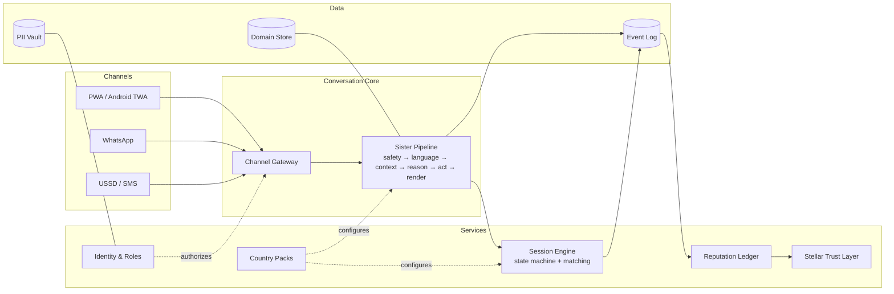
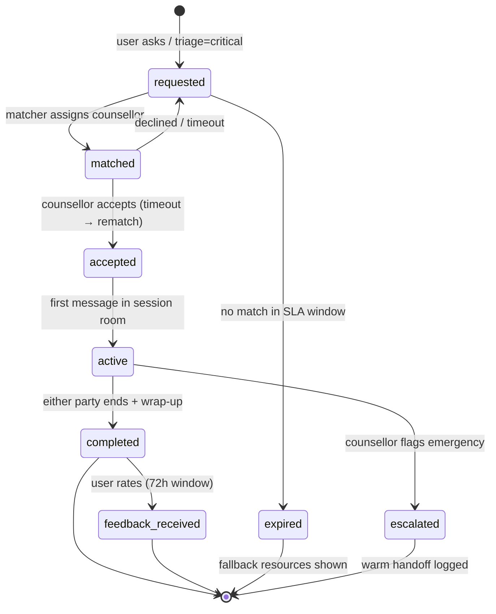

# SisterCare v2 — Target Architecture Blueprint

*A from-first-principles redesign of the entire system, written as the destination
we migrate toward — not a big-bang rewrite. Section 11 maps every piece of the
current codebase to its place in this design.*

---

## 0. How to read this document

This is a design document in the Google style: it states constraints, makes
decisions, and records what was deliberately **not** chosen. When you touch a
subsystem, read its section here first. When reality diverges from this
document, change one of them in the same PR.

The single most important sentence in this document:

> **SisterCare is not a chatbot with features. It is a trust platform that
> connects a vulnerable person to help — AI help instantly, human help
> verifiably — over whatever channel and connectivity she has.**

Every architectural decision below follows from that sentence.

---

## 1. First principles — the constraints that shape everything

These are facts about our users, not opinions about technology. A design that
ignores any of them is wrong regardless of how elegant it is.

| # | Constraint | Architectural consequence |
|---|------------|--------------------------|
| C1 | Connectivity is intermittent and data is expensive | Offline-first client; tiny payloads; nothing critical requires a round-trip |
| C2 | The phone may be shared or inspected (stigma) | Disguise mode, quick-exit, local data encrypted, notifications neutral |
| C3 | Users speak 8+ languages; some prefer voice to text | Language is a pipeline stage, never an afterthought; voice is a first-class modality |
| C4 | A crisis message is a life-safety event | Deterministic safety layer runs before and independent of any LLM; escalation has an SLA |
| C5 | Users mostly cannot pay | Cost per conversation is a designed number, not an outcome; sponsors fund sessions |
| C6 | Counsellor trust cannot be assumed (credential fraud exists) | Verification workflow + tamper-evident attestation (Stellar) |
| C7 | Team is small (2 people) | Managed services only; one deployable per surface; no ops burden |
| C8 | Uganda first, continent next | Everything country-specific is data (a "country pack"), never code |

---

## 2. The system in one picture



Three ideas carry the whole design:

1. **One conversation core, many channels.** The PWA is just the first client.
   WhatsApp, USSD, and future channels are thin adapters over the same gateway.
2. **An explicit event log is the spine.** Every domain fact is an event.
   Routing, reputation, Stellar anchoring, analytics, and impact metrics are
   all *consumers* of the same log — never separate sources of truth.
3. **Sessions are the load-bearing aggregate.** The counsellor economy,
   reputation, payments, and the safety story all depend on sessions being
   observable state machines inside the platform.

---

## 3. Design principles (opinionated, numbered, cite them in PRs)

- **P1 — Deterministic before probabilistic.** Regex/lexicon safety checks and
  cycle math run before and independent of any model. An LLM may *add* care;
  it may never be the only thing standing between a user and harm.
- **P2 — Degrade, never fail.** Every dependency has a defined fallback
  (Section 8). The user always gets *something* helpful.
- **P3 — The server trusts only verified identity.** No route acts on a
  client-claimed uid. (Landed in v1.5 with `firebaseAdmin.ts`.)
- **P4 — PII and health data never share a record.** The AI sees a pseudonym
  and the minimum context needed for the current turn (Section 7).
- **P5 — User data never touches the chain.** Not hashed, not encrypted, not
  at all. Only counsellor professional records and aggregate proofs anchor.
- **P6 — Country logic is configuration.** If you are writing `if (uganda)`,
  you are writing a bug.
- **P7 — Prompts are governed artifacts.** System prompts, crisis responses,
  and clinical content are versioned files with named clinical reviewers, not
  strings in code.
- **P8 — Every shilling of compute is attributed.** Cost per conversation is a
  tracked metric with a budget (Section 9).

---

## 4. Subsystem design

### 4.1 Channel Gateway

A single internal API — `POST /conversation/turn` — that every channel adapter
calls with a normalized envelope:

```ts
interface InboundTurn {
  channel: "pwa" | "whatsapp" | "ussd" | "sms";
  identity: VerifiedIdentity;          // from Firebase token or channel binding
  text?: string;                        // one of text | audioRef
  audioRef?: string;                    // uploaded voice note (feeds STT)
  channelCaps: {                        // what the channel can render
    richUI: boolean;                    // action chips, cards, audio player
    audioOut: boolean;
    maxChars?: number;                  // USSD/SMS budgets
  };
  locale?: LanguageCode;                // channel hint, pipeline may override
}
```

The pipeline returns a **channel-neutral response** (text + optional audio +
optional structured actions); each adapter renders it within its capabilities.
USSD gets a 160-char budget and menu digits; WhatsApp gets voice notes and
quick replies; the PWA gets the full UI. **The pipeline never knows which
channel it is serving** — that is what makes "Sister on WhatsApp" a two-week
adapter project instead of a fork.

WhatsApp identity binding: a one-time code links a WhatsApp number to a
Firebase account (or provisions a lightweight anonymous account). The number
hash lives in the PII vault, not the domain store.

### 4.2 The Sister Pipeline

The current `/api/chat` route is this pipeline, implicit. v2 makes each stage
an explicit, independently testable module with a uniform contract
(`(TurnContext) → TurnContext`):

```
1. SAFETY GATE      deterministic lexicons (all languages) on raw input
2. LANGUAGE         detect → STT if audio → translate to pivot (EN)
3. SAFETY GATE #2   same checks on translated text  ← the v1 gap, now law
4. CONTEXT          load pseudonymous profile, cycle state, session state
5. ROUTE            tier decision: deterministic | cached | small model | agent
6. REASON/ACT       the agent loop (tools) OR canned/deterministic answer
7. SAFETY REVIEW    output screen: crisis resources intact, no medical overreach
8. RENDER           translate back, TTS if channel wants audio, format actions
```

Two additions over v1:

- **Stage 7 (output screening)** — a cheap deterministic pass ensuring model
  output never contradicts the safety layer (e.g., the model must not
  discourage contacting Sauti 116, must not diagnose, must not promise
  confidentiality it can't keep).
- **Stage 5 (the router)** is where unit economics live — see 4.7.

Each stage emits timing + outcome to the event log, which is how we get the
observability in Section 6 for free.

### 4.3 Event backbone

Firestore collection `events/` (append-only) + Cloud Functions triggers.
No Kafka, no Pub/Sub until scale demands it (C7) — the *pattern* matters, not
the transport, and Functions-on-Firestore-write gives us at-least-once
delivery with zero ops.

Core event catalog:

| Event | Emitted by | Consumed by |
|---|---|---|
| `turn.completed` | Pipeline | analytics, cost ledger |
| `crisis.detected` | Safety gate | escalation engine, admin alerting, SLA clock |
| `session.requested / matched / accepted / active / completed / expired` | Session engine | matching, reputation, payments, notifications |
| `feedback.received` | Client | reputation ledger |
| `counsellor.presence_changed` | Presence service | matching (drain the queue) |
| `counsellor.verified` | Admin console | Stellar credential anchoring |
| `reputation.epoch_closed` | Reputation ledger | Stellar Merkle anchoring |
| `checkin.recorded` (WHO-5/PHQ-2) | Pipeline | impact metrics |

Rule: **consumers are idempotent** (event id as dedupe key). Rule: events are
facts, past tense, immutable. Corrections are new events.

### 4.4 Session Engine — the load-bearing wall



Decisions:

- **Sessions are in-app chat rooms** (a `sessions/{id}/messages` subcollection
  with rules granting exactly two uids access). Voice later via masked-number
  telephony (Twilio/Africa's Talking) so personal numbers are never exposed —
  a real safety issue for counsellors *and* users. WhatsApp handoff remains an
  escape hatch, never the default, because every off-platform session takes
  its safety oversight, feedback, and reputation data with it.
- **Matching is event-driven, not request-time-only.** Unmatched requests sit
  in a queue; `counsellor.presence_changed → available` triggers a Cloud
  Function that drains the queue best-match-first. This is the "keep routing
  when counsellors declare themselves free" requirement, done right.
- **The crisis lane preempts.** `triage=critical` requests skip the queue,
  page the top N eligible counsellors simultaneously (first-accept wins), and
  start the escalation SLA clock (Section 6).
- **Presence is heartbeat-based** (Realtime Database presence or 60s client
  heartbeat + TTL): a counsellor who closes her laptop goes offline
  automatically instead of showing "available" forever.
- Timeouts (`matched → requested`, `requested → expired`) run on **Cloud
  Tasks**, not client timers.

### 4.5 Matching v2

Score = weighted sum over available counsellors (weights in country pack):

```
specialty_match     × 0.30      // crisis type → specialization
language_match      × 0.25      // user's language in counsellor's set
reputation          × 0.20      // Bayesian-adjusted rating (see 4.9)
load_balance        × 0.15      // inverse of active caseload
recency_fairness    × 0.10      // time since last assignment
```

The current `assignCounsellor` scoring survives almost intact — it becomes the
pure function inside this engine, finally unit-tested, with reputation swapped
in for raw rating.

### 4.6 Identity, roles, and the pseudonym boundary

- **One Firebase Auth instance.** Roles as custom claims:
  `role: user | counsellor | admin`, set exclusively by server code:
  counsellor at admin approval, admin by existing admin (first via console).
  Every route and every Firestore rule branches on the verified claim.
- **Two identifiers per user.** `uid` (auth identity, lives with PII) and
  `pid` (pseudonym, random, unlinkable without the vault mapping). **The
  pipeline, the event log, the AI, and all analytics see only `pid`.** The
  mapping `uid ↔ pid` lives in the PII vault (Section 7), readable only by
  the identity service. A Gemini prompt containing "Amina, 22, pregnant,
  suicidal" is a breach waiting to happen; "user p_8f3a, cycle day 24,
  triage critical" is not.
- Anonymous accounts are first-class (Firebase anonymous auth): a user can get
  full AI + crisis support without ever giving a name, and upgrade to a
  credentialed account later without losing history.

### 4.7 AI orchestration — the model router

The router (pipeline stage 5) is where C5 becomes engineering:

| Tier | Handles | Engine | Marginal cost |
|---|---|---|---|
| 0 | Cycle dates, reminders, FAQs, library lookups, greetings | Deterministic code + content index | ~0 |
| 1 | Repeated/similar questions | Semantic cache (embedding match over past Q→A, per language) | ~0 |
| 2 | Routine supportive chat | Small model (flash-lite class), short context | tiny |
| 3 | Complex emotional conversations, tool-using agent turns | Full agent loop (2.5-flash → 2.5-pro fallback) | the budget |
| F | Everything, when all models are down | Local keyword responder (exists today) | 0 |

Routing signals: triage severity (critical → never below tier 3 unless models
down — then crisis flow is deterministic anyway), tool-need prediction,
conversation depth, cache hit confidence. Every turn logs
`tier, tokens, cost_estimate` to the event log → the cost dashboard in §9.

**The prompt registry** (P7): system prompts, crisis responses, and clinical
content live in `packages/content/` as versioned markdown with frontmatter
(`version`, `reviewed_by`, `review_date`, `languages`). CI blocks changes to
`safety-critical: true` content without a reviewer field change. This is how
"2–3 Ugandan clinicians reviewed Sister's behavior" becomes an auditable fact
rather than a claim.

### 4.8 Language system & country packs

A country pack is a directory of data, no code:

```
packs/ug/
  languages.json        # supported codes, TTS speaker ids, STT models
  crisis-lexicons/      # native-language crisis patterns per language  ← v1's
  crisis-resources.md   #   NATIVE_SELF_HARM_PATTERN, generalized
  resources.json        # helplines, hospitals, legal aid (Sauti, FIDA, ...)
  matching-weights.json # Section 4.5 weights
  compliance.md         # DPPA notes, retention rules
  payments.json         # mobile-money rails, currency, anchor config
packs/ke/               # market #2: Swahili exists, M-Pesa anchor exists
```

The pipeline loads the pack at startup keyed by the user's country. Expansion
to Kenya becomes: write `packs/ke/`, recruit counsellors, done. Translation
gets a **translation memory** (cache of confirmed translations, per pack) in
front of Sunbird → Gemini fallback, cutting both cost and latency for the long
tail of repeated phrases.

### 4.9 The trust layer — one coherent Stellar story

Four functions, one narrative: *verified humans, observed work, portable
reputation, auditable money.*

1. **Credential attestation** (exists in v1, gets its trigger): admin approves
   counsellor → hash of verified credential bundle anchors on-chain via
   `manageData`. Tamper-evident "SisterCare verified this license on date X."
2. **Reputation ledger** (off-chain, append-only `reputation_events/`):
   completed sessions, feedback, complaints, no-shows. Score is **Bayesian**
   (a 5.0★ from 3 sessions ranks below 4.8★ from 300), time-decayed, computed
   by a pure, unit-tested function. Anti-gaming: only platform-observed
   sessions count; feedback weight scales with rater account age; admins can
   freeze pending review.
3. **Reputation anchoring**: monthly epoch close → Merkle root of the epoch's
   reputation events anchors on-chain (reuses v1 `buildMerkleRoot`). A
   counsellor can *prove* "412 sessions, 4.9 adjusted rating, attested by
   SisterCare" to any third party — a portable professional asset, which is
   the honest version of the "NFT rank" idea (soulbound attestation, not a
   transferable token; transferable reputation is incoherent).
4. **Sponsored-session payments** (the strongest Stellar use case, phased
   last): sponsor funds session credits (USDC on Stellar) → escrow account →
   `session.completed` event releases counsellor payout → anchor to
   MTN MoMo / Airtel Money. Donor-auditable impact ("this grant paid for
   10,000 sessions — verifiable") is a fundraising superpower for this
   category. Platform fee is taken at release.

Invariant, restated as law: **nothing derived from user data ever anchors.**

### 4.10 Client architecture (PWA v2)

- **Local-first domain core.** Cycle math (`cycle.ts` — already pure) runs on
  device against an encrypted local store (IndexedDB via a thin repository
  interface). Reminders schedule locally via the service worker. The tracker
  works with airplane mode on, forever (C1). Sync is opportunistic,
  last-write-wins with vector timestamps per field group — simple, adequate,
  because a single user rarely writes concurrently from two devices.
- **Feature-sliced UI.** The 81KB `chat/page.tsx` monolith becomes
  `features/chat/{ConversationList, Thread, Composer, VoiceRecorder,
  ActionStatus}` with one reducer owning conversation state. Same treatment
  for dashboard and onboarding. Design system tokens (colors, spacing, type
  scale) extracted to a single source so the three surfaces (user, counsellor,
  admin) share a visual language.
- **Safety UX** (C2): optional disguise launcher (neutral icon + calculator
  skin), a persistent quick-exit gesture that swaps to a weather page and
  clears back-stack, notifications that never mention periods or counselling
  ("You have a new message 💜"), and a panic-wipe (local data) behind settings.
- **Voice-first surfaces**: mic button is primary in the composer (not an
  afterthought icon); answers auto-play audio in non-English when the user
  spoke; latency budget for STT→answer→TTS is a tracked metric.

### 4.11 Counsellor & admin surfaces

Separate route groups in the same Next.js app (C7 — one deployable), gated by
role claims:

- `/counsellor`: presence toggle (heartbeat), incoming-request cards with
  context summary + accept/decline, active session rooms, caseload view,
  session wrap-up form (structured outcome + private encrypted notes),
  earnings, own reputation view with epoch history.
- `/admin`: counsellor application review (documents → checklist → approve =
  claim set + credential anchor), crisis monitor (live SLA board), content
  management for the library and prompt registry approvals, dispute/report
  queue, cost + impact dashboards.

---

## 5. Data model (Firestore, target)

| Collection | Keyed by | Contains | Access |
|---|---|---|---|
| `vault/{uid}` | auth uid | PII: name, phone/WhatsApp hash, uid↔pid map | identity service only (admin SDK); no client reads |
| `profiles/{pid}` | pseudonym | preferences, language, country, coarse demographics | owner via mapped uid |
| `health/{pid}/cycle` `health/{pid}/symptoms` `health/{pid}/pregnancy` | pseudonym | domain health data | owner; server via admin SDK |
| `conversations/{pid}/...` | pseudonym | AI chat threads | owner |
| `sessions/{sid}` + `/messages` | session id | state machine doc + room | the two participant uids + admin |
| `counsellors/{cid}` | counsellor uid | public profile, specializations, languages | public read; owner + admin write |
| `counsellors_private/{cid}` | counsellor uid | license docs, verification checklist | admin + owner |
| `presence/{cid}` | counsellor uid | status + heartbeat TTL | owner write; matcher read |
| `queue/{qid}` | request id | unmatched session requests | server only |
| `reputation_events/{eid}` | event id | append-only ledger (§4.9) | server only; aggregates public |
| `events/{eid}` | event id | the backbone (§4.3) | server only |
| `packs/{country}` | country code | country pack mirror (hot-editable subset) | public read; admin write |

Rules philosophy: client rules grant **owner-only** access on `pid`-keyed
data; everything cross-cutting goes through admin-SDK server code (which is
why the Admin-SDK write migration is the keystone task). Retention: raw
`events` TTL 13 months (Firestore TTL policy); conversation content
user-deletable; vault erasure = cryptographic unlink of `uid↔pid` + PII purge,
which orphans (anonymizes) all pseudonymous data in one operation — that is
the DPPA delete story, and it is cheap *because* of the pseudonym boundary.

---

## 6. Safety architecture & SLOs

- **The golden safety corpus**: a versioned test set of real-pattern crisis
  messages (all 8 languages, misspellings, slang, code-switching) + hard
  negatives. CI runs the full corpus against the safety gate on every PR
  touching `safety`, lexicons, or prompts; a regression blocks merge. This
  corpus is the most valuable test asset the project will own. (v1 seeded it:
  35 tests today.)
- **Escalation SLA**: `crisis.detected` starts a clock; `session.accepted`
  (or documented warm handoff) stops it. Metric: **time-to-human**, target
  p90 < 10 min during staffed hours, alert at 15. The live board is on the
  admin crisis monitor. This number is the product's integrity; it goes in
  grant reports.
- **Output screening** (stage 7) failures emit `safety.output_blocked` events
  — reviewed weekly; three of the same class = prompt registry fix.
- **Clinical governance**: named reviewers on safety-critical content (P7);
  quarterly review of crisis flows with the advisory clinicians; MOU with
  Sauti 116 so escalation is a warm handoff, not a phone number in a bubble.
- **Well-being outcomes**: WHO-5 / PHQ-2 check-ins woven into conversations
  (opt-in, spaced) → `checkin.recorded` → impact dashboard. This is both
  clinical monitoring and the evidence base for funding.

---

## 7. Privacy & compliance

- **Registration + DPIA under Uganda DPPA (2019)** before public launch.
- **The pseudonym boundary is the mechanism** (§4.6): third-party AI providers
  receive `pid` + minimal turn context, never name+health together. Sunbird
  receives text without any identifier.
- **Counsellor session notes** are encrypted client-side with a key wrapped
  per-participant (the platform can delete but not read them). Honest tradeoff,
  documented: admin cannot audit note *content*, only metadata — disputes rely
  on in-room messages, which are platform-visible and both parties know it.
- **Say exactly what we do.** The README privacy claims get rewritten to match
  implementation (at-rest encryption by GCP, pseudonymous AI calls, no sale of
  data, subpoena reality). In this category one broken promise is fatal; the
  fix for over-claiming is under-claiming.

---

## 8. Reliability — the degradation ladder

| Failure | User experience |
|---|---|
| Gemini down (all tiers) | Deterministic answers + local responder; crisis flow unaffected (never depended on it) |
| Sunbird down | Gemini translation fallback → hand-written localized strings → English with apology; native crisis lexicons still fire |
| Firestore degraded | Client serves local store; writes queue in outbox; agent persistence retries via event log |
| Matching finds nobody | `expired` state → country-pack resources + callback promise + queue position honesty |
| Stellar/Horizon down | Anchoring queues (it was always batch); zero user-facing impact |
| Everything down | PWA shell + local cycle tracker + offline page with emergency numbers (works today) |

Chaos drill twice a quarter: kill one dependency in staging, verify the ladder.

---

## 9. Cost model (unit economics)

Tracked per conversation, budgeted per tier (§4.7). Targets at Uganda scale
(assumptions documented in the dashboard, revisited quarterly):

- Tier distribution goal: ≥60% of turns at tiers 0–1 (≈free), ≤10% at tier 3.
- **Cost per active user-month** is the number sponsors buy; the dashboard
  converts it to "one sponsored user = X USD/month" for the B2B2C pitch.
- LLM spend alarms at 120% of weekly budget; the router degrades tier 3 → 2
  for non-critical traffic under budget pressure (never for crisis).

---

## 10. What we deliberately did NOT choose

| Rejected | Why |
|---|---|
| Microservices / Kubernetes | C7. Two people. Functions + one Next.js app deploy in minutes with zero ops. Revisit at 7 figures of MAU, not before. |
| Custom backend (Node/Go on Cloud Run) for the core | The gateway abstraction gives us the seam; move individual stages out only when a concrete limit (timeout, memory, fan-out) bites. |
| Self-hosted / fine-tuned LLMs | Cost, ops, and safety review burden dwarf API spend at our scale. The router keeps us portable. |
| Kafka / Pub/Sub now | Firestore-triggered Functions are at-least-once and ops-free; the event *catalog* is the asset, transport is swappable. |
| Transferable reputation tokens | Reputation that can be sold is not reputation. Soulbound attestation only. |
| E2E encryption of AI conversations | Would blind the safety layer — an explicit, documented anti-goal. Counsellor *notes* are E2E; AI chat is pseudonymous instead. |
| Native iOS/Android apps | PWA + TWA covers Android (the market); revisit iOS with traction. |

---

## 11. Migration path (strangler fig, from today's code)

What survives largely intact — the v1.5 hardening work was chosen to be v2's
foundation:

| Today | Becomes | Change |
|---|---|---|
| `src/lib/cycle.ts` (pure, tested) | client + server domain core | none — already v2-shaped |
| `src/lib/safety.ts` (pure, tested) | safety gate stage | patterns move into country-pack lexicons |
| `src/lib/firebaseAdmin.ts` | identity service seed | add custom-claims helpers |
| `src/lib/agent/executor.ts` | tier-3 engine inside the router | strip rate limiting (moves to gateway), receive `pid` context |
| `src/lib/sunbird.ts` (+ TTS memo) | language stage | add translation memory |
| `src/lib/stellar/*` | trust layer | unchanged mechanics; new triggers (verification, epochs) |
| `src/lib/firestore.ts` (2k lines) | split: repositories (admin SDK server-side) + client repos | the keystone refactor |
| `src/app/api/chat/route.ts` | thin gateway adapter for channel=pwa | pipeline stages extracted per §4.2 |
| `src/app/chat/page.tsx` | `features/chat/*` slices | decompose behind stable props |
| `firestore.rules` | regenerated from §5 table | rules become reviewable per-collection |

Phase order (each phase ships value alone):

1. **Keystone**: Admin-SDK repositories for server writes + custom-claims
   roles. (Unblocks everything; ends the silent-write failure class.)
2. **Sessions**: state machine + in-app rooms + presence + feedback + the
   crisis lane and SLA clock. (The counsellor economy now exists.)
3. **Pipeline extraction**: stages as modules, router with tiers 0/1/F,
   event log + cost ledger. (Unit economics + observability.)
4. **Trust**: verification workflow → credential anchoring; reputation ledger
   + Bayesian scoring feeding matching; first epoch anchor.
5. **Reach**: WhatsApp adapter on the gateway; country pack extraction
   (Uganda pack = refactor, Kenya pack = expansion); payments pilot.
6. **Continuous**: chat page decomposition, disguise mode, impact check-ins.

---

## 12. Open questions (decide before their phase)

1. Counsellor payout compliance: which anchor/licence path for UGX payouts —
   partner with an existing Stellar anchor or integrate MoMo APIs directly?
2. Session pricing: sponsor-credit denominations and whether users ever pay.
3. Anonymous-user crisis escalation: what can a counsellor do with zero
   identity? (Design the "no-PII warm handoff" script with Sauti.)
4. Presence transport: Firestore heartbeat vs Realtime Database — benchmark
   cost at 200 concurrent counsellors.
5. Semantic cache privacy: cache keys must be `pid`-free embeddings; verify
   no reconstruction risk before enabling cross-user cache hits.

---

*This document is the destination. The repo is the journey. Keep them honest
with each other — update this file in the same PR that changes an
architectural decision.*
