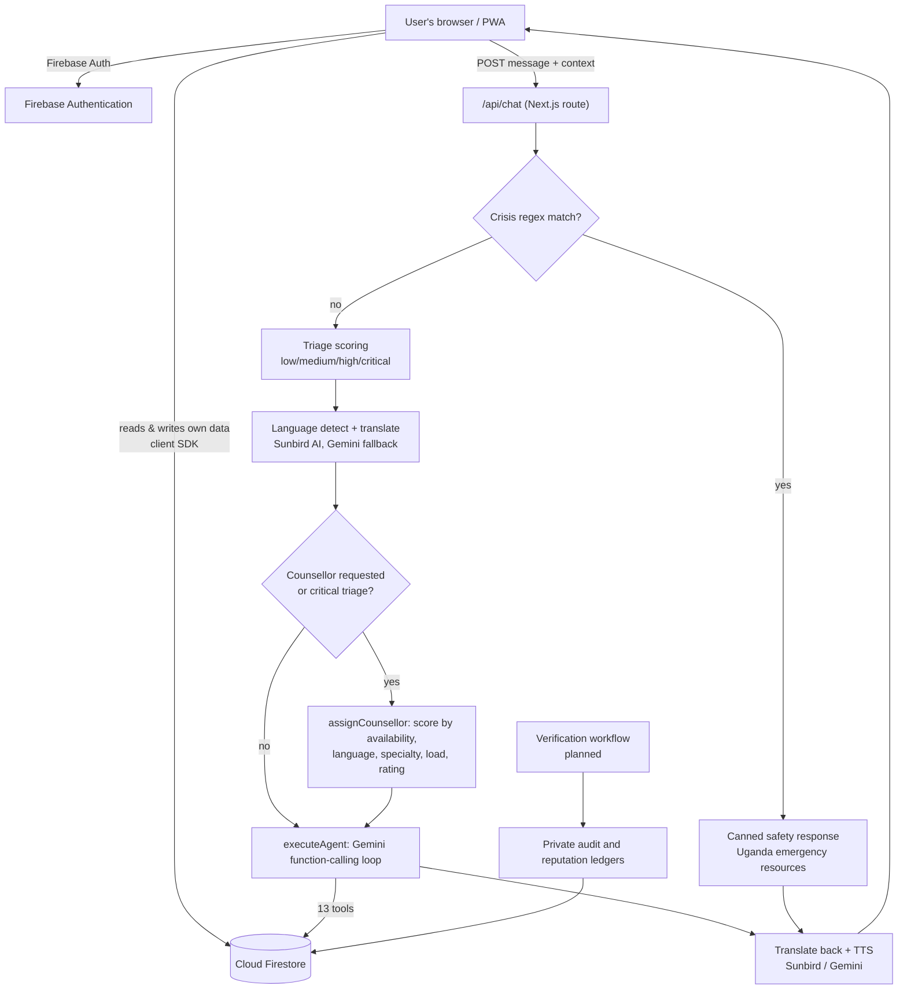

# SisterCare — Developer Onboarding Guide

> **Audience:** Engineers joining the SisterCare team.
> **Goal:** After reading this document you should understand what SisterCare is, how the codebase is organized, how every major subsystem works, how data flows through the application, and where the sharp edges are.
>
> Last updated: July 2026. If you change a subsystem described here, update the relevant section in the same pull request.

---

## Table of Contents

1. [What Is SisterCare?](#1-what-is-sistercare)
2. [Tech Stack](#2-tech-stack)
3. [Getting Started (Local Setup)](#3-getting-started-local-setup)
4. [Repository Layout](#4-repository-layout)
5. [High-Level Architecture](#5-high-level-architecture)
6. [The Chat Pipeline (`/api/chat`)](#6-the-chat-pipeline-apichat)
7. [The AI Agent](#7-the-ai-agent)
8. [Data Layer & Firestore Schema](#8-data-layer--firestore-schema)
9. [Cycle-Tracking Domain Logic](#9-cycle-tracking-domain-logic)
10. [Counsellor System](#10-counsellor-system)
11. [Language & Voice Support](#11-language--voice-support)
12. [Trust, Audit & Reputation](#12-trust-audit--reputation)
13. [Frontend Application](#13-frontend-application)
14. [PWA, Offline & Notifications](#14-pwa-offline--notifications)
15. [API Reference](#15-api-reference)
16. [Conventions & Workflow](#16-conventions--workflow)
17. [Known Issues, Gotchas & Roadmap](#17-known-issues-gotchas--roadmap)

---

## 1. What Is SisterCare?

SisterCare is a **mobile-first Progressive Web App (PWA)** serving young women in Uganda across three pillars:

| Pillar | What we ship |
|---|---|
| **Mental health support** | "Sister", an AI companion users can talk to privately, 24/7, with built-in crisis detection and escalation to Ugandan emergency resources (Sauti 116, Uganda Police, FIDA Uganda, Butabika Hospital). |
| **Menstrual health** | Cycle tracking with phase awareness (menstrual → follicular → ovulation → luteal), next-period prediction, reminders, symptom and mood logging, and pregnancy/postpartum tracking. |
| **Human connection** | A network of professional counsellors. The agent can automatically match a user to a counsellor by specialty, language, availability, and load, and hand the conversation off. |

**Why it exists:** many of our users have no safe person to talk to. Mental-health topics and menstruation are stigmatized; a private, judgment-free, local-language companion — with a path to real human professionals — is the product.

**Design principles that shape technical decisions:**

- **Safety first.** Crisis situations are handled by deterministic, human-written responses — never by the LLM (§6.1).
- **Degrade, don't fail.** Every external dependency (Gemini, Sunbird, Firestore) has a fallback path. The user should never see a dead end.
- **Uganda-first.** Local languages (Luganda, Runyankole, Ateso, Acholi, Lugbara, Swahili, Luo), local emergency resources, low-data PWA design.

**Product direction (not all built yet):** three account roles — **user**, **counsellor**, **admin** — with a counsellor portal (availability toggle, session queue) and an admin console for verification and oversight. Counsellor verification and session-based reputation remain private, auditable platform records (§12). See §17.3 for the roadmap.

---

## 2. Tech Stack

| Concern | Technology | Notes |
|---|---|---|
| Framework | **Next.js (App Router)** | Pages in `src/app/`, API routes in `src/app/api/`. |
| Language | **TypeScript** (strict) | `npx tsc --noEmit` must pass. |
| Styling | **Tailwind CSS 3.4** | Custom theme in `tailwind.config.ts`; global styles in `src/app/globals.css`. |
| Auth | **Firebase Authentication** | Email/password + Google sign-in. |
| Database | **Cloud Firestore** | Client SDK (`firebase` npm package). See §8 and the gotcha in §17.1. |
| LLM | **Google Gemini** | `gemini-2.5-flash` → `gemini-2.5-pro` → `gemini-2.0-flash` fallback chain, via raw REST (`v1beta generateContent`), with function calling. |
| Local-language AI | **Sunbird AI** | Speech-to-text, language ID, NLLB translation, text-to-speech for Ugandan languages. |
| Audit & reputation | **Firestore event ledgers** | Server-only, append-only verification and reputation records. |
| PWA | Custom service worker | `public/sw.js` (v2), `public/manifest.json`, `public/offline.html`. |
| Fonts / icons | Manrope (Google Fonts), Material Symbols Outlined | |

There is **no test framework and no CI pipeline yet** (§17.2). Verification today = `npx tsc --noEmit`, `npm run lint`, and manual testing.

---

## 3. Getting Started (Local Setup)

### Prerequisites

- Node.js 18+
- A Firebase project with **Authentication** (Email/Password + Google providers) and **Firestore** enabled
- A **Gemini** API key ([Google AI Studio](https://aistudio.google.com/))
- Optional: a **Sunbird AI** API key for local-language features

### Steps

```bash
git clone https://github.com/RockieRaheem/SisterCare.git
cd SisterCare
npm install
cp .env.example .env.local   # then fill in ALL variables below
npm run dev                  # http://localhost:3000
```

Deploy Firestore security rules from `firestore.rules` (Firebase Console → Firestore → Rules, or `firebase deploy --only firestore:rules`).

### Environment variables — complete list

> ⚠️ `.env.example` currently only lists the Firebase block. The variables below are **all** read by the code. Never commit `.env.local` (it is gitignored).

| Variable | Required | Used by |
|---|---|---|
| `NEXT_PUBLIC_FIREBASE_API_KEY` | Yes | `src/lib/firebase.ts` |
| `NEXT_PUBLIC_FIREBASE_AUTH_DOMAIN` | Yes | " |
| `NEXT_PUBLIC_FIREBASE_PROJECT_ID` | Yes | " |
| `NEXT_PUBLIC_FIREBASE_STORAGE_BUCKET` | Yes | " |
| `NEXT_PUBLIC_FIREBASE_MESSAGING_SENDER_ID` | Yes | " |
| `NEXT_PUBLIC_FIREBASE_APP_ID` | Yes | " |
| `NEXT_PUBLIC_FIREBASE_MEASUREMENT_ID` | No | Analytics (client only) |
| `GEMINI_API_KEY` | Yes (chat is dead without it) | `src/app/api/chat/route.ts`, agent executor |
| `SUNBIRD_API_KEY` | Recommended | `src/lib/sunbird.ts` — translation, language ID, TTS, STT. **Use the server-side name; do NOT set `NEXT_PUBLIC_SUNBIRD_API_KEY`** (the code accepts it, but it would embed the secret in the client bundle). |

### Scripts

| Command | What it does |
|---|---|
| `npm run dev` | Development server |
| `npm run build` | Production build |
| `npm run start` | Serve production build |
| `npm run lint` | ESLint (`next lint`) |
| `npx tsc --noEmit` | Typecheck (run before every PR) |

### Smoke test

1. Open `http://localhost:3000` → landing page renders.
2. Sign up → you are routed through onboarding (name, last period date, cycle/period length, reminder days).
3. Dashboard shows a cycle ring with current phase and days-until-next-period.
4. Chat: send "when is my next period?" → Sister answers with a concrete date (the agent used the `get_cycle_info` tool).
5. `GET http://localhost:3000/api/chat` → JSON health check listing agent capabilities and `apiKeyConfigured: true`.

---

## 4. Repository Layout

```
SisterCare/
├── src/
│   ├── app/                        # Next.js App Router
│   │   ├── page.tsx                # Landing page
│   │   ├── layout.tsx              # Root layout (providers, fonts, SW registration)
│   │   ├── globals.css             # Global styles, animations, glass morphism
│   │   ├── auth/login|signup/      # Auth screens
│   │   ├── onboarding/             # First-run cycle setup wizard
│   │   ├── dashboard/              # Cycle ring, mood log, phase tips
│   │   ├── chat/                   # Sister chat UI (largest client component)
│   │   ├── counsellors/            # Directory + [counsellorId] profile page
│   │   ├── library/                # Health articles
│   │   ├── analytics/              # Charts / insights page
│   │   ├── settings/ profile/ help/ about/ privacy/ terms/
│   │   └── api/
│   │       ├── chat/route.ts       # ★ THE core endpoint — agent pipeline (§6)
│   │       ├── health/route.ts     # Service health check
│   │       └── counsellors/sync-availability/route.ts
│   ├── components/
│   │   ├── ui/                     # Button, Card, Input, Toggle, Skeleton,
│   │   │                           # SymptomLoggerModal, NotificationBell,
│   │   │                           # PeriodReminderBanner, OfflineIndicator
│   │   ├── layout/                 # Header, Footer, BottomNav (mobile tab bar)
│   │   ├── features/               # CounsellorCard, ReminderBanner
│   │   └── auth/ProtectedRoute.tsx # Client-side route guard
│   ├── context/
│   │   ├── AuthContext.tsx         # Firebase auth state + Firestore profile (§13.2)
│   │   ├── ThemeContext.tsx        # light / dark / system
│   │   └── LanguageContext.tsx     # UI language (en | lg) (§11.1)
│   ├── hooks/useReminders.ts       # Period reminder scheduling/consumption
│   ├── lib/
│   │   ├── firebase.ts             # Firebase app/auth/db singletons
│   │   ├── firestore.ts            # ★ ALL Firestore ops + cycle math + counsellor
│   │   │                           #   assignment (~1,800 lines — see §8, §9, §10)
│   │   ├── agent/
│   │   │   ├── executor.ts         # ★ Agent loop, tool dispatch, fallbacks (§7)
│   │   │   ├── tools.ts            # 13 Gemini function declarations
│   │   │   ├── knowledge.ts        # Health KB, Uganda resources, risk scoring
│   │   │   └── index.ts            # Public re-exports
│   │   ├── sunbird.ts              # Sunbird AI client (STT/translate/TTS/langID)
│   │   ├── ttsCache.ts             # TTS audio cache (currently unused — §17.1)
│   │   ├── i18n/                   # UI translations (en.ts, lg.ts)
│   │   ├── localChatStore.ts       # localStorage chat fallback + tombstones
│   │   ├── counsellors.ts          # Counsellor helpers
│   │   ├── notifications.ts / pushNotifications.ts
│   │   ├── accessibility.ts / auth.tsx
│   │   └── ...
│   └── types/index.ts              # ★ Canonical domain types — read this first
├── public/
│   ├── sw.js                       # Service worker v2 (§14)
│   ├── manifest.json               # PWA manifest (start_url: /dashboard)
│   ├── offline.html                # Offline fallback page
│   └── icons/                      # PWA icons (72–512px)
├── docs/                           # Architecture, onboarding, and research docs
├── firestore.rules                 # Firestore security rules
├── firebase.json
├── home_dashboard/ … support_chat_interface/   # ⚠ Design mockups ONLY
│                                   # (code.html + screen.png pairs) — not live code
└── .github/copilot-instructions.md # AI-assistant + commit conventions (§16)
```

**Start here when reading code:** `src/types/index.ts` → `src/app/api/chat/route.ts` → `src/lib/agent/executor.ts` → `src/lib/firestore.ts`. Those four files contain ~80% of the system's behavior.

---

## 5. High-Level Architecture



Key architectural facts to internalize:

1. **The client owns most persistence.** Pages talk to Firestore directly through the client SDK under the signed-in user's credentials; security rules enforce per-user ownership. The API route additionally attempts server-side writes when agent tools run — see the important caveat in §17.1.
2. **The API is stateless per request.** The client sends `message`, `conversationHistory`, `userId`, `cycleData`, `userProfile`, `conversationId`, `userLanguage` in the POST body. There is no server session.
3. **Safety logic is deterministic and runs before the LLM.** The LLM never generates crisis responses.
4. **Everything degrades.** Firestore counsellors → static list; Sunbird translation → Gemini translation → hand-written localized strings; Gemini model A → B → C → local keyword responder.

---

## 6. The Chat Pipeline (`/api/chat`)

File: `src/app/api/chat/route.ts` (~1,370 lines). This is the most important file in the repository. `POST` handles a message through the following **ordered** stages — the order is intentional and safety-critical:

### Stage 0 — Validation
Reject missing/non-string messages and messages > 2,000 chars.

### Stage 1 — Triage scoring (`assessTriageSeverity`)
Regex classification of the raw message into `critical` (self-harm / violence / danger), `high` (harassment, abuse, panic, trauma), `medium` (anxious, sad, cramps…), or `low`. The result rides along the whole pipeline, is logged as an `agentEvent`, and drives counsellor handoff behavior.

### Stage 2 — Language resolution
Priority: explicit client selection → in-message request ("speak Luganda") → stored profile preference → Sunbird language detection → English default. Non-English messages are translated **to English** for the agent (Sunbird `nllb_translate`; on failure, Gemini translates; on failure, the original text passes through with a `MANDATORY LANGUAGE MODE: <Language>` directive so the model answers in the user's language anyway).

Special short-circuits before the agent runs:
- **Language-switch confirmations** — hand-written acknowledgements per language.
- **Direct Luganda responses** (`getDirectLugandaResponse`) — curated, reviewed replies to known sensitive Luganda phrases (e.g. pregnancy disclosure while in school). These bypass the LLM entirely for quality and safety in our most important local language.
- **Luganda intent hints** (`addLanguageIntentHint`) — appends an English gloss to recognized Luganda phrases so the agent understands intent even if translation fails.

### Stage 3 — Period auto-update
If the message matches `PERIOD_START_PATTERN` ("my period started", "started 3 days ago", "backtrack"…), the route immediately writes `lastPeriodDate` + recalculated `nextPeriodDate` to the profile and logs a `cycle_updated` event. ⚠ Known bug: "started X days ago" is *not* parsed here and defaults to *today*; the agent's `update_period_start` tool handles the calculation correctly and may write a second, corrected value (§17.1).

### Stage 4 — Crisis check (`checkForCrisis`)
Regexes over the raw message for family abuse, self-harm/suicide (highest priority, includes slang: "kms", "wanna die", "end it all"), violence toward others, harassment, danger, and general abuse. A match returns a **hand-written response** with Ugandan emergency contacts and skips the agent entirely. Editing `CRISIS_PATTERNS` / `CRISIS_RESPONSES` is a **safety-reviewed change** — do not modify casually, and be aware of the non-English gap in §17.1.

### Stage 5 — Counsellor handoff
Triggered by explicit request patterns (counsellor/call/WhatsApp), pronoun references to an already-active counsellor ("call her"), or `critical` triage. Flow:
1. Pronoun reference + `conversationId` → reuse the conversation's active counsellor.
2. Otherwise infer specialty from the message (`inferCounsellorSpecialty`) and preferred language, then call `routeCounsellor` → `assignCounsellor` (§10).
3. On match: create/reuse a counsellor conversation (`connectUserToCounsellor`), pin counsellor metadata on it, log the event, and return a response containing a full `counsellorProfile` payload (the chat UI renders a profile card with call/WhatsApp links).
4. No match: localized fallback message with Sauti 116 / Mental Health Uganda numbers and a link to the directory; `high` (non-critical) triage gets an *offer* appended to the agent response instead of auto-connect.

### Stage 6 — The agent
`executeAgent` (§7) runs with full context. Its response gets any handoff text appended.

### Stage 7 — Localization + voice
`localizeResponse` translates the final English text back to the user's language (Sunbird → Gemini fallback → hand-written per-language fallback strings if the "translation" still looks English via `isProbablyEnglishText`) and generates TTS audio through Sunbird (per-language speaker IDs). TTS failure is non-fatal.

### Response shape

```jsonc
{
  "response": "…final localized text…",
  "language": "lug", "languageName": "Luganda", "translationApplied": true,
  "audio": { "url": "…", "durationSeconds": 4.2, "mimeType": "audio/mpeg" },
  "source": "agent" | "safety" | "local_fallback" | "rate_limited" | "error",
  "toolsUsed": ["get_cycle_info"],
  "actions": ["…human-readable action log…"],
  "triage": { "severity": "medium", "reason": "wellbeing_concern" },
  "actionStatuses": [ { "key": "triage", "label": "…", "state": "done" } ],
  "counsellorProfile": { /* only on handoff */ },
  "reasoning": "…"
}
```

`actionStatuses` powers the step-indicator UI in the chat page. Errors map to: 429 + `Retry-After` (rate limits), 504 (timeouts), 503 (missing API key), 500 (everything else) — always with a friendly `response` string so the UI can render it directly.

---

## 7. The AI Agent

Files: `src/lib/agent/executor.ts`, `tools.ts`, `knowledge.ts`.

### 7.1 Execution loop

`executeAgent(apiKey, message, context)`:

1. **In-process throttle** — min 2s between calls, max 6 requests/min, 60s cooldown after 3 consecutive failures. ⚠ Module-level state: global across *all* users and per-serverless-instance (§17.1). When throttled, the local fallback responder answers instead of erroring.
2. **Model fallback chain** — try `gemini-2.5-flash`, then `gemini-2.5-pro`, then `gemini-2.0-flash`; any error advances to the next model.
3. **Per-model run** (`executeWithModel`) — builds the request: last **15 turns** of history, the system prompt enriched with user name, live cycle stats, and pregnancy/postpartum context, all 13 tool declarations (`mode: AUTO`), `temperature 0.7`, `maxOutputTokens 1024`, safety settings at `BLOCK_ONLY_HIGH`. Then a standard function-calling loop, max **5 iterations**: model returns `functionCall` parts → `executeTool` runs each → results go back as `functionResponse` parts → repeat until the model produces text.
4. **Response cleaning** — `cleanResponse` strips markdown (bold/italic/code/headings) because the chat UI renders plain text.
5. **Local fallback** — if every model fails (or output is empty), `generateFallbackResponse` answers from ~30 keyword patterns: crisis patterns first (mirroring §6.4), then cycle questions answered *from real context data*, cramps/mood support, greetings, name-related requests, counsellor requests, and frustration de-escalation. This is why the app stays conversational even with no working LLM.

### 7.2 Tool catalogue (`tools.ts` → dispatch in `executeTool`)

| Tool | Effect | Persists to Firestore? |
|---|---|---|
| `get_cycle_info` | Phase, cycle day, days-to-next-period from context | — |
| `log_symptoms` | Save symptoms/mood/flow/notes | ✅ `users/{uid}/symptoms` |
| `analyze_symptoms` | Risk assessment + KB lookup | — |
| `calculate_fertility_window` | Ovulation/fertile-window dates + advice | — |
| `set_reminder` | Create a reminder (parses "tomorrow", "in 3 days", ISO) | ✅ `users/{uid}/reminders` |
| `search_health_info` | Query the built-in health knowledge base | — |
| `find_healthcare_resources` | Uganda hospitals/helplines/support orgs by type & location | — |
| `get_symptom_history` | Fetch + pattern-summarize recent logs | reads ✅ |
| `assess_risk_level` | Symptom risk; anything concerning during pregnancy ⇒ `urgent` | — |
| `generate_health_report` | Cycle summary + recommendations | — |
| `update_period_start` | Record period start, recompute next period | ✅ user profile |
| `update_pregnancy_status` | Pregnancy on/off, due date (computes LMP + 280 days), trimester | ✅ user profile |
| `record_birth` | Clear pregnancy, restart cycle tracking from birth date | ✅ user profile |
| `get_personalized_tips` | Phase-specific tips (nutrition/exercise/sleep/mood/pain) | — |

All tool writes are wrapped in try/catch — persistence failure never crashes the conversation, but note §17.1 about *silent* failure.

### 7.3 System prompt behavior contract

The prompt (top of `executor.ts`) enforces: remember conversation context; always use tools instead of saying "I don't know"; calculate dates from "X days ago" phrasing; **pregnancy mode** (congratulate → ask due date/LMP → call tool → stop asking about periods; postpartum advice after `record_birth`); ask about an overdue period at most once; warm concise tone (2–4 sentences, ≤2 emojis); obey `MANDATORY LANGUAGE MODE`; Uganda resource awareness. If you change tool names/schemas, update the prompt's rules and examples in the same PR — they reference tools by name.

### 7.4 Knowledge base (`knowledge.ts`)

- `HEALTH_KNOWLEDGE_BASE` — 12 curated articles (cycle basics, dysmenorrhea, menorrhagia, irregular periods, PMS/PMDD, fertility, pregnancy signs, abnormal bleeding, discharge, nutrition, period anxiety, hygiene), searched by `searchHealthKnowledge`.
- `UGANDA_HEALTHCARE_RESOURCES` — emergency numbers, helplines, Kampala + regional hospitals, support organizations.
- `assessSymptomRisk` / `SYMPTOM_RISK_DATA` — maps symptoms to `normal | monitor | urgent` with recommendations.

Content changes here are **clinical content changes** — have them reviewed by someone with health expertise, not just an engineer.

---

## 8. Data Layer & Firestore Schema

File: `src/lib/firestore.ts` — the single data-access module (~1,800 lines). No other file should call Firestore directly.

### 8.1 Collections

```
users/{uid}                          # UserProfile: email, displayName, onboardingCompleted,
│                                    #   preferences{emailNotifications, pushNotifications,
│                                    #   reminderDaysBefore, theme, language},
│                                    #   cycleData{lastPeriodDate, cycleLength, periodLength,
│                                    #   nextPeriodDate, currentPhase}, pregnancyData{...}
├── symptoms/{id}                    # SymptomLog: date, mood, symptoms[], flowIntensity, notes
├── reminders/{id}                   # Reminder: type, title, message, scheduledFor, sent, read
├── cycleHistory/{id}                # CycleHistory: startDate, endDate, lengths, symptoms, notes
└── agentEvents/{id}                 # AgentEvent: type (triage|handoff_offered|handoff_connected|
                                     #   cycle_updated|pregnancy_updated|birth_recorded),
                                     #   severity, conversationId, success, createdAt

conversations/{id}                   # ChatConversation: userId, title, type (ai_support|counsellor),
│                                    #   status, lastMessage, messageCount,
│                                    #   activeCounsellorId + activeCounsellor{...} (handoffs)
└── messages/{id}                    # ChatMessage: sender (user|ai|counsellor), content,
                                     #   timestamp, read

counsellors/{id}                     # Counsellor: name, title, bio, specializations[],
                                     #   languages[], status (available|busy|offline), rating,
                                     #   reviewCount, yearsExperience, phone/whatsapp,
                                     #   availableHours{start,end,days[]}, verified, sessionCount
```

Timestamps are Firestore `Timestamp`s in storage and converted to JS `Date`s at the data-layer boundary — keep that conversion inside `firestore.ts`.

### 8.2 Security rules (`firestore.rules`)

- `users/{userId}` and **all** subcollections: owner-only (`request.auth.uid == userId`). This covers symptoms, reminders, cycleHistory, and agentEvents.
- `conversations`: create requires `request.resource.data.userId == request.auth.uid`; read/update/delete require ownership. `messages` checks the parent conversation's `userId` via `get()`.
- `counsellors`: any authenticated user can **read**; **writes are disabled** (`allow write: if false`) — intended to be Console/admin-managed. Note the consequences in §17.1.
- Top-level `reminders`, `symptomLogs`, `cycleHistory` rule blocks are **legacy** — the code writes these as `users/{uid}` subcollections; the top-level rules match nothing today. Don't "fix" code to match them; the rules should be cleaned up instead.

### 8.3 Notable data-layer functions

Beyond CRUD: `getOrCreateConversation` / `createNewChat` / `updateConversationPreview` (chat list maintenance), `schedulePeriodReminders` (clears + re-creates period reminders per preference), `seedCounsellors`, and the counsellor routing suite (§10). Cycle math also lives here (§9).

---

## 9. Cycle-Tracking Domain Logic

The heart of the product. Canonical implementation: `getCycleInfo` / `calculateNextPeriod` in `src/lib/firestore.ts` (⚠ a near-duplicate exists in `executor.ts` — see §17.1; treat `firestore.ts` as the source of truth).

**Model:** a cycle starts on `lastPeriodDate` and is `cycleLength` days long (default 28); the period itself lasts `periodLength` days (default 5).

**Rolling prediction:** if the user hasn't logged a period for more than one cycle, the math rolls forward — `cyclesPassed = floor(daysSinceLast / cycleLength)` — so "day in cycle" and next-period predictions stay meaningful without new input.

**Phases** (as implemented):

| Phase | Days (28-day example) | Rule |
|---|---|---|
| `menstrual` | 1–5 | `dayInCycle <= periodLength` |
| `follicular` | 6–12 | `dayInCycle <= floor(cycleLength * 0.45)` |
| `ovulation` | 13–15 | `dayInCycle <= floor(cycleLength * 0.55)` |
| `luteal` | 16–28 | otherwise |

**Lateness:** `isPeriodLate` when a full expected cycle has elapsed with no new period logged; `daysLate = daysSinceLast − cycleLength`. The route uses this to have Sister *gently ask once* whether the period started (`shouldPromptCycleConfirmation`, `isSignificantlyOverdue` at ≥7 days late).

**Fertility window** (`calculateFertilityWindow`, executor): ovulation ≈ `cycleLength − 14`; fertile window = 5 days before through 1 day after; rolls to next cycle when passed.

**Pregnancy mode:** `savePregnancyData` flips the profile into pregnancy tracking (due date = LMP + 280 days when not provided; trimester boundaries at weeks 13/27). While pregnant, the agent is instructed not to discuss cycles. `record_birth` → `updateCycleAfterBirth` clears pregnancy and restarts cycle tracking from the birth date.

All of this is pure, deterministic date math — **if you touch it, add unit tests** (there are none yet; §17.2). Dates are normalized to midnight to avoid DST/time-of-day drift.

---

## 10. Counsellor System

### 10.1 Data & fallback
Counsellors live in the `counsellors` collection; if the collection is empty or unreachable, `STATIC_COUNSELLORS` (six hard-coded profiles in `firestore.ts`) keeps the feature working. ⚠ All static profiles share one placeholder phone number — this is demo data, not real counsellors.

### 10.2 Assignment algorithm (`assignCounsellor`)

1. Fetch candidates by specialty (or all); fall back to static.
2. If nobody speaks the preferred language, retry the static list on language.
3. `evaluateTimeAvailability(counsellor)` — is *now* within `availableHours` (start/end + weekday list)?
4. `getCounsellorLoads()` — count active conversations per counsellor (load balancing).
5. `calculateCounsellorScore` — weighted sum over availability-now, language match, specialty match, inverse load, and rating.
6. Sort; return the top scorer. `routeCounsellor` is the thin public wrapper the chat route calls.

### 10.3 Availability sync
`batchUpdateCounsellorAvailability` (exposed via `POST /api/counsellors/sync-availability`) recomputes `available`/`offline` for every counsellor from their hours; `autoUpdateCounsellorStatus` does the same for a single counsellor during routing. ⚠ Both write to `counsellors`, which the rules forbid — see §17.1.

### 10.4 Handoff conversation
`connectUserToCounsellor` creates (or reuses) a `type: "counsellor"` conversation; `setActiveCounsellorOnConversation` pins a denormalized counsellor snapshot on it so later pronoun references ("call her") resolve without re-matching.

### 10.5 Where this is heading
Planned (not yet built): role-based accounts via Firebase custom claims (`user` / `counsellor` / `admin`), a counsellor portal with a real presence-based availability toggle and session queue, an admin verification console, an explicit session state machine (`requested → matched → accepted → active → completed → feedback`), and reputation scoring feeding routing priority. Keep new counsellor code compatible with that direction — e.g., don't add more logic that assumes counsellors are contacted only by external phone/WhatsApp.

---

## 11. Language & Voice Support

There are **two separate language systems** — don't confuse them:

### 11.1 UI translations (`src/lib/i18n/`)
Static dictionaries for interface strings. Languages: **English (`en`)** and **Luganda (`lg`)** only. Accessed via `LanguageContext` + `getTranslation(lang, "dot.path")` with automatic English fallback. Adding a UI language = new file in `translations/` + register in `i18n/index.ts`.

### 11.2 Conversation languages (`src/lib/sunbird.ts`)
Sunbird AI (`https://api.sunbird.ai/tasks`) powers the *chat* in 8 languages: Luganda (`lug`), Runyankole (`nyn`), Ateso (`teo`), Acholi (`ach`), Lugbara (`lgg`), English (`eng`), Swahili (`sw`), Luo (`luo`) — each with a TTS speaker ID. Client functions: `speechToText`, `detectLanguage`, `translateText` (NLLB), `textToSpeech`, `summarizeText`.

**Translation resilience chain (memorize this):** Sunbird → Gemini translation (`translateWithGemini`) → `isProbablyEnglishText` heuristic detects silent failures → hand-written per-language fallback strings (`fallbackLocalizedResponse`) → English. Plus the model-level `MANDATORY LANGUAGE MODE` directive as belt-and-braces.

The chat UI currently exposes `eng` and `lug` in its language picker (`CHAT_LANGUAGE_OPTIONS` in `chat/page.tsx`); the backend supports all eight. Voice input uses the browser's Web Speech API when available (see `src/types/speech.d.ts`); Sunbird STT exists for local-language audio.

---

## 12. Trust, Audit & Reputation

SisterCare keeps its trust model deliberately private and operationally simple. Firebase Authentication custom claims establish the caller's role; the admin console records counsellor verification decisions; and server-only Firestore collections retain immutable domain and reputation events.

**Verification:** an admin reviews a counsellor's identity, qualifications, license status, and supporting evidence. Only the resulting verification state and operational metadata are exposed to product surfaces. Sensitive evidence remains access-controlled and must never enter public logs.

**Reputation:** `reputation_events/` is an append-only server ledger populated from platform-observed sessions, feedback, complaints, and no-shows. Future scoring should be Bayesian, time-decayed, unit-tested, and resistant to manipulation. Scores inform matching but never replace human review.

**Audit rules:** API routes verify Firebase ID tokens, use the verified UID instead of client-supplied identity, and emit immutable events for consequential state changes. Corrections are new events rather than edits to history. Firestore security rules deny all client access to `events/` and `reputation_events/`.

---

## 13. Frontend Application

### 13.1 Pages

| Route | Notes |
|---|---|
| `/` | Landing page |
| `/auth/login`, `/auth/signup` | Email/password + Google (popup) |
| `/onboarding` | Multi-step wizard → `completeOnboarding` writes profile + cycle data |
| `/dashboard` | Cycle ring, phase card, mood check-in, tips, reminder banner |
| `/chat` | Sister chat (§13.3) |
| `/counsellors`, `/counsellors/[counsellorId]` | Directory (filter by specialty/status/search) + profile with call/WhatsApp actions |
| `/library` | Article cards by category |
| `/analytics` | Cycle/symptom insight charts |
| `/settings` | Notifications, reminder timing, theme, language, sign-out |
| `/profile` | Edit name + cycle parameters |
| `/help`, `/about`, `/privacy`, `/terms` | Static |

Protected pages are guarded **client-side** by `components/auth/ProtectedRoute.tsx` (redirects unauthenticated users). There is no server-side route protection — data safety relies on Firestore rules.

### 13.2 Contexts (mounted in `app/layout.tsx`)

- **`AuthContext`** — wraps `onAuthStateChanged`; exposes `user` (lightweight), `userProfile` (full Firestore profile), `signIn/signUp/signOut/signInWithGoogle`, `refreshProfile`. Resilience detail: if the profile fetch hits offline/permission errors, it installs a **temporary in-memory profile** (with retry for offline) so the UI never blocks — meaning `userProfile` can be a placeholder; don't treat its presence as proof the Firestore doc exists.
- **`ThemeContext`** — light/dark/system, persisted, drives the `dark` class.
- **`LanguageContext`** — UI language (`en`/`lg`), persisted under `sistercare-language`.

### 13.3 The chat page (`src/app/chat/page.tsx`)

The largest client component (~80KB, 30+ state hooks) — a ChatGPT-style two-pane UI: conversation sidebar (search, pin, rename, delete-with-modal, relative timestamps) and thread view (date separators, streamed-text animation, icebreaker suggestions, voice input, per-message audio playback, copy, agent action-status chips, counsellor profile cards on handoff).

Persistence strategy: conversations/messages live in Firestore; **`localChatStore.ts` mirrors them in `localStorage`** as an offline/permission-failure fallback, including **deletion tombstones** so a conversation deleted locally never resurrects from a stale mirror (`cleanDeletedTombstones` reconciles against Firestore IDs). When editing chat code, keep both paths in sync.

> Refactoring this page into `Sidebar` / `Thread` / `Composer` components with a reducer is an accepted, welcomed cleanup (§17.3).

### 13.4 UI conventions

Design tokens: primary `#8c30e8`, light bg `#f7f6f8`, dark bg `#191121`, font Manrope, Material Symbols icons, 12px default radius, glass-morphism accents. Every screen must work in **dark mode** and at **mobile widths** (mobile uses `BottomNav`; desktop uses `Header`). Reuse `components/ui/*` primitives before writing new ones.

---

## 14. PWA, Offline & Notifications

- **`public/sw.js` (v2):** pre-caches core routes/assets and Google-Fonts CSS on install; runtime caching with a dynamic cache; navigation failures fall back to `offline.html`. **Bump `CACHE_VERSION` whenever you change cached routes or the SW itself** — stale caches are the classic "my change doesn't show up" trap (DevTools → Application → Service Workers → *Update on reload* while developing).
- **`public/manifest.json`:** standalone display, `start_url: /dashboard`, portrait orientation, maskable icons 72–512px.
- **Reminders:** `hooks/useReminders.ts` + `lib/notifications.ts` schedule and surface period reminders (`reminderDaysBefore` preference, default 3); `PeriodReminderBanner` renders upcoming-period warnings; `lib/pushNotifications.ts` handles browser push permission/subscription. Email notifications have a settings toggle but **no sending backend yet**.
- **`OfflineIndicator`** shows connectivity state; cycle math is client-side and works offline; chat requires connectivity.

---

## 15. API Reference

All routes are Next.js route handlers under `src/app/api/`. ⚠ **None of them currently authenticate the caller** — see §17.1 before exposing any deployment publicly.

| Endpoint | Method | Purpose |
|---|---|---|
| `/api/chat` | POST | The agent pipeline (§6). Body: `{ message, conversationHistory?, userId?, cycleData?, userProfile?, conversationId?, userLanguage? }`. |
| `/api/chat` | GET | Agent health check: capabilities, models, `apiKeyConfigured`. |
| `/api/health` | GET | Service health/status. |
| `/api/counsellors/sync-availability` | POST | Recompute all counsellor statuses from `availableHours`. |

---

## 16. Conventions & Workflow

**Branch/PR flow:** small, focused PRs into `main`. Before pushing: `npx tsc --noEmit` and `npm run lint` must pass; manually exercise the flow you changed (there is no test suite yet to catch you).

**Commit messages:** one line, present-tense imperative, specific — e.g. `Fix counsellor routing with static fallback`. See `.github/copilot-instructions.md`, which also defines conventions for AI coding assistants used on this repo (including a required trailing `Commit:` line in assistant responses that modify code).

**Code style:**
- TypeScript everywhere; avoid `any` (the codebase currently has almost none — keep it that way).
- All Firestore access goes through `src/lib/firestore.ts`; all domain types live in `src/types/index.ts`.
- Follow existing resilience idiom: external calls wrapped, failures logged with a prefixed tag (`[Agent] …`, `[SW] …`) and degraded gracefully — but prefer *surfacing* persistence failures to the user over silently claiming success (see §17.1).
- UI: Tailwind only, dark-mode + mobile-first mandatory, reuse `components/ui/*`.

**Sensitive areas requiring extra review:**
| Area | Why |
|---|---|
| `CRISIS_PATTERNS` / `CRISIS_RESPONSES` / triage (route.ts) | User safety. Test against real phrasings, slang, typos. |
| Agent system prompt + tool schemas (executor.ts / tools.ts) | Behavior contract; prompt references tools by name. |
| Cycle math (firestore.ts §9) | Core correctness; users plan their lives around it. |
| `knowledge.ts` content | Clinical accuracy — needs health-expert review. |
| `firestore.rules` | Data privacy boundary. |
| Anything touching role assignment or verification | Changes trusted access or professional status. |

---

## 17. Known Issues, Gotchas & Roadmap

Read this section carefully — it will save you days.

### 17.1 Active gotchas (true today; fix-in-progress items)

1. **Everything auth- and persistence-related requires `FIREBASE_SERVICE_ACCOUNT_KEY`.** With it configured: API routes verify ID tokens (verified uid overrides the body's `userId`), and server-side writes go through the **Admin SDK** data layer (`src/lib/server/serverData.ts`), so agent tool persistence, `logAgentEvent`, counsellor handoffs, and availability sync all actually persist. Without it: routes run in **unenforced dev mode** (warning logged at startup) and server code falls back to the client SDK, where security rules silently deny server-side writes — the old behavior. Production deployments MUST set it; do not deploy publicly with a funded mainnet issuer key without it.
2. **Server code must import from `src/lib/server/serverData.ts`, never `src/lib/firestore.ts`.** The client-SDK module is for browser code. If you add a new server-side data operation, implement it in `serverData.ts` (admin impl + client fallback, following the existing pattern). Never import `serverData.ts` or `firebaseAdmin.ts` from a client component — they pull in `firebase-admin`.
3. **The session platform (Phase 2) is live but needs configured auth.** Counselling sessions (`sessions` collection + `/api/sessions*`), counsellor presence (`/api/presence`), the counsellor portal (`/counsellor`), and the session room (`/sessions/[id]`) all require `FIREBASE_SERVICE_ACCOUNT_KEY` — the APIs return 503 without it. Key design points: the queue IS the set of `requested` sessions (no separate collection); matching only considers counsellors with a fresh presence heartbeat (≤2 min), so demo-directory counsellors are never assigned sessions; `accept` auto-activates the room; all transitions go through the API while room *messages* flow client-side under participant-scoped rules; run `POST /api/sessions/sweep` on a cron (CRON_SECRET) every ~5 min for accept-timeouts, expiry, and queue draining. Counsellor accounts: set `role: counsellor` via `/api/admin/roles`; their `counsellors/{uid}` directory doc should use their auth uid as the doc id.
4. **Rate limiting is per-user but per-instance** (`executor.ts`): counters live in server memory, so on serverless each lambda has its own window. Fine as a courtesy limit; hard quotas belong at the edge or in a shared store.
5. **Docs drift** — README mentions Next 16.1 / "Flash-Lite"; older docs say Next 14. The code's model chain is `gemini-2.5-flash → 2.5-pro → 2.0-flash`. Trust the code, then this guide, then the README.
6. **Static counsellors are demo data** with a shared placeholder phone number; email notifications and data export have UI but no backend.
7. **`src/lib/ttsCache.ts` (browser-side IndexedDB cache) is still unused** — the server now skips English TTS and memoizes repeats in-process, but the client never caches received audio locally.

### 17.2 Recently fixed (don't re-report these)

- **Crisis detection now runs on the translated text too**, with native Luganda/Swahili self-harm patterns as translation-down fallback. The logic lives in `src/lib/safety.ts` (unit-tested; safety-critical review area).
- **Cycle math is consolidated** in `src/lib/cycle.ts` (pure, unit-tested); `firestore.ts` re-exports it and the executor delegates to it.
- **"Started X days ago" parses correctly** and vague phrases ("update my period") no longer pre-write today's date.
- **Dependencies are pinned** to tested versions; `vitest` runs 35 unit tests; GitHub Actions CI runs typecheck + tests on every push/PR.
- **English responses skip TTS** (latency + quota win); repeated non-English synthesis is memoized server-side (`textToSpeechCached`).
- `.env.example` now lists every variable the code reads, including `FIREBASE_SERVICE_ACCOUNT_KEY`.

### 17.3 Missing infrastructure (accepted debt)

- **Test coverage gaps:** API authorization and audit-event persistence need integration coverage. Counsellor matching is covered by `src/lib/counsellorMatching.ts` and its test file.
- **Lint isn't in CI** (`next lint` is deprecated under Next 16; migrate to the ESLint CLI first).

### 17.4 Roadmap (agreed direction)

1. **Foundation:** API auth (ID-token verification + Admin SDK), role-based accounts via custom claims (`user`/`counsellor`/`admin`).
2. **Platform:** counsellor portal (presence-based availability, request queue), in-app sessions with an explicit lifecycle state machine, feedback capture, and an admin verification console.
3. **Reputation & payments:** anti-gaming reputation scoring feeding routing priority; sponsor accounting and counsellor payouts through direct mobile-money integrations.
4. **Reach:** Sister on WhatsApp (the pipeline is channel-agnostic by design), voice-first UX, offline-first hardening, country packs for expansion beyond Uganda.

---

## Appendix: Reading List

- `docs/ARCHITECTURE_V2.md` — the target architecture blueprint (channel-agnostic gateway, event backbone, session engine, trust layer) and the migration map from today's code. Read it before proposing structural changes.
- `docs/SYSTEM_OVERVIEW.md` — earlier plain-language feature inventory (some sections outdated; this guide supersedes it where they conflict).
- `docs/SUNBIRD_AI_RESEARCH.md` — Sunbird capability research.
- `docs/Flo_Health_Literature_Review.md`, `docs/Flow.io_Literature_Review.md` — competitive/domain research.
- `.github/copilot-instructions.md` — collaboration and commit conventions.

*Welcome to the team. When something in the code surprises you, check §17 first — and if it isn't listed there, add it.*
